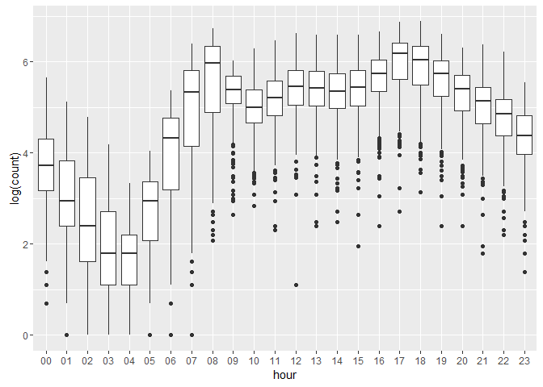

BikeSharingDemandChallenge
================
Chinmay Abhyankar

read train data
===============

``` r
library(ggplot2);
library(stringi);

train = read.csv("train.csv");
```

read test data
==============

``` r
test = read.csv("test.csv");
```

combine train and test data to see the distribution of independent variables together
=====================================================================================

``` r
#test data has less attributes than train data
#first add all the missing attributes in test data
test$casual = 0
test$registered = 0
test$count = 0

datacombined = rbind(train,test)
```

view the structure of data
==========================

``` r
str(datacombined)
```

    ## 'data.frame':    17379 obs. of  12 variables:
    ##  $ datetime  : Factor w/ 17379 levels "2011-01-01 00:00:00",..: 1 2 3 4 5 6 7 8 9 10 ...
    ##  $ season    : int  1 1 1 1 1 1 1 1 1 1 ...
    ##  $ holiday   : int  0 0 0 0 0 0 0 0 0 0 ...
    ##  $ workingday: int  0 0 0 0 0 0 0 0 0 0 ...
    ##  $ weather   : int  1 1 1 1 1 2 1 1 1 1 ...
    ##  $ temp      : num  9.84 9.02 9.02 9.84 9.84 ...
    ##  $ atemp     : num  14.4 13.6 13.6 14.4 14.4 ...
    ##  $ humidity  : int  81 80 80 75 75 75 80 86 75 76 ...
    ##  $ windspeed : num  0 0 0 0 0 ...
    ##  $ casual    : num  3 8 5 3 0 0 2 1 1 8 ...
    ##  $ registered: num  13 32 27 10 1 1 0 2 7 6 ...
    ##  $ count     : num  16 40 32 13 1 1 2 3 8 14 ...

missing values in data
======================

``` r
summary(is.na(datacombined))
```

    ##   datetime         season         holiday        workingday     
    ##  Mode :logical   Mode :logical   Mode :logical   Mode :logical  
    ##  FALSE:17379     FALSE:17379     FALSE:17379     FALSE:17379    
    ##  NA's :0         NA's :0         NA's :0         NA's :0        
    ##   weather           temp           atemp          humidity      
    ##  Mode :logical   Mode :logical   Mode :logical   Mode :logical  
    ##  FALSE:17379     FALSE:17379     FALSE:17379     FALSE:17379    
    ##  NA's :0         NA's :0         NA's :0         NA's :0        
    ##  windspeed         casual        registered        count        
    ##  Mode :logical   Mode :logical   Mode :logical   Mode :logical  
    ##  FALSE:17379     FALSE:17379     FALSE:17379     FALSE:17379    
    ##  NA's :0         NA's :0         NA's :0         NA's :0

distribution of numerical values
================================

``` r
par(mfrow = c(4,2))
par(mar = rep(2, 4))
qplot(season, data = datacombined,binwidth = .1)
```


``` r
qplot(weather, data = datacombined,binwidth = .1)
```


``` r
qplot(humidity, data = datacombined,binwidth = .1)
```


``` r
qplot(holiday, data = datacombined,binwidth = .1)
```


``` r
qplot(workingday, data = datacombined,binwidth = .1)
```


``` r
qplot(temp, data = datacombined,binwidth = .1)
```


``` r
qplot(atemp, data = datacombined,binwidth = .1)
```


``` r
qplot(windspeed, data = datacombined,binwidth = .1)
```

 \#some inferences from the above plot

``` r
#season has 4 categories of almost equal distribution
#weather has most of the data in 1st category
#less entries in the category 1 for holidays
#most entries in category 1 for working day attribute
#temp and atemp are naturally distributed
```

converting discrete variables into factors
==========================================

``` r
names = c("season", "holiday","weather","workingday")
datacombined[,names] =lapply(datacombined[,names],FUN = as.factor)
str(datacombined)
```

    ## 'data.frame':    17379 obs. of  12 variables:
    ##  $ datetime  : Factor w/ 17379 levels "2011-01-01 00:00:00",..: 1 2 3 4 5 6 7 8 9 10 ...
    ##  $ season    : Factor w/ 4 levels "1","2","3","4": 1 1 1 1 1 1 1 1 1 1 ...
    ##  $ holiday   : Factor w/ 2 levels "0","1": 1 1 1 1 1 1 1 1 1 1 ...
    ##  $ workingday: Factor w/ 2 levels "0","1": 1 1 1 1 1 1 1 1 1 1 ...
    ##  $ weather   : Factor w/ 4 levels "1","2","3","4": 1 1 1 1 1 2 1 1 1 1 ...
    ##  $ temp      : num  9.84 9.02 9.02 9.84 9.84 ...
    ##  $ atemp     : num  14.4 13.6 13.6 14.4 14.4 ...
    ##  $ humidity  : int  81 80 80 75 75 75 80 86 75 76 ...
    ##  $ windspeed : num  0 0 0 0 0 ...
    ##  $ casual    : num  3 8 5 3 0 0 2 1 1 8 ...
    ##  $ registered: num  13 32 27 10 1 1 0 2 7 6 ...
    ##  $ count     : num  16 40 32 13 1 1 2 3 8 14 ...

My hypothesis:counts should be more in peak hours
=================================================

lets verify my hypothesis
=========================

we would use substring so first let us check the lenghth of datetime attribute
==============================================================================

``` r
stri_length(datacombined[1,]$datetime) #use stringi package
```

    ## [1] 19

use substr fuction
==================

``` r
datacombined$hour = substr(datacombined$datetime, 12, 13)
datacombined$datetime = as.factor(datacombined$datetime)
```

I will analyze train only as test data does not have anything in count
======================================================================

therfore lets seperate train and test data
==========================================

``` r
train = datacombined[1:10886,]
test = datacombined[10887:17379,]
```

analysis of count vs hour for training dataset
==============================================

``` r
qplot(hour, count, data = train, geom = "boxplot")
```

 \#Validation of my hypothesis: \#High number of counts between hours 7-9 and 17-19 \#Average number of counts for hours 10-16 \#Low number of counts between hours 0-6 and 20-24

Now let us do same analysis for registered and casual users
===========================================================

``` r
qplot(hour, registered, data = train, geom = "boxplot")
```


``` r
qplot(hour, casual, data = train, geom = "boxplot")
```

 \#My inference:Pattern for registered user is same as that of count \#whereas pattern for casual is little bit different. \#So we can conclude that hour is a significant factor for prediction

let us analyze count on log scale to see if we can find some pattern
====================================================================

also it will treat the outlier well
===================================

``` r
qplot(hour, log(count), data = train, geom = "boxplot")
```


